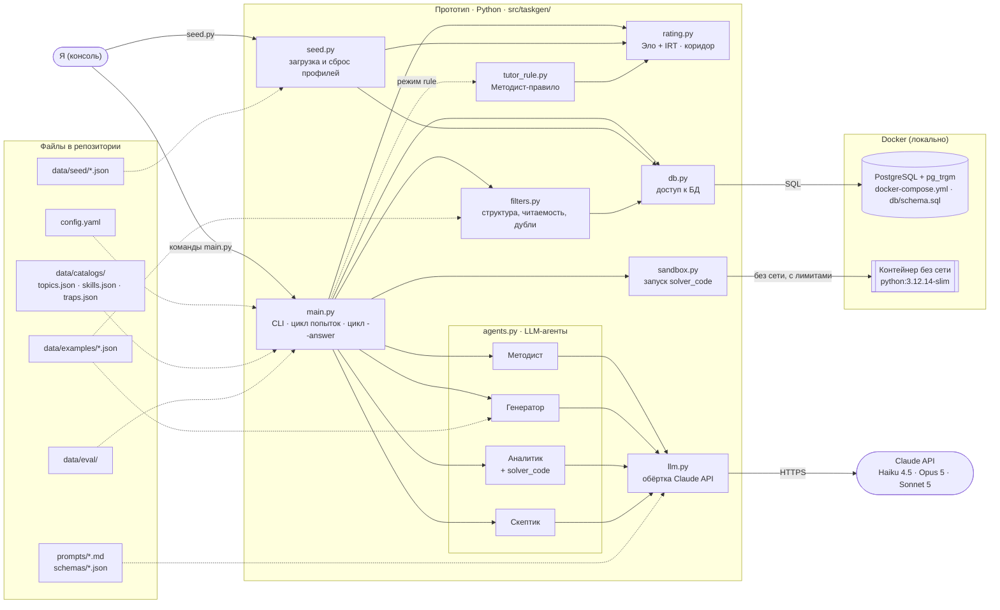

# 01. Контекстная схема

> Задача T01 из [RUN.md](../../RUN.md). Источник — [SPEC.md](../../SPEC.md), разделы 2, 5, 7, 8, 10.

Из чего состоит прототип и с чем он общается. Прототип — это Python-скрипты на моей машине. Снаружи у него только два соседа: Claude API в интернете и Docker на той же машине, где живут PostgreSQL и песочница для кода.

## Схема

**Как читать:**
- Сплошная стрелка — вызов или запрос.
- Пунктирная стрелка — чтение файла или необязательный режим.

## Компоненты

| Компонент | За что отвечает | SPEC |
|---|---|---|
| `main.py` | CLI: `--student`, `--answer`, `--fresh`, `--tutor`. Оркестрация запроса: коридор → Методист → банк → генерация и проверка. Цикл попыток и консенсус, цикл `--answer` | 3, 6, 10 |
| `agents.py` · Методист | ТЗ на задачу по профилю, рейтингам и каталогам | 5.1 |
| `agents.py` · Генератор | Задача по ТЗ с 3 эталонами и «зерном» | 5.2 |
| `agents.py` · Аналитик | Слепое решение, разбор для ребёнка, `solver_code` | 5.3 |
| `agents.py` · Скептик | Поиск дефектов условия по чек-листу | 5.4 |
| `tutor_rule.py` | Методист-правило без LLM, базовая линия | 5.7 |
| `rating.py` | Вероятность P, обновление θ, δ, β, коридор сложности | 5.6 |
| `filters.py` | Структура ответа Генератора, читаемость условия, близкие дубли в банке и среди эталонов | 6 |
| `llm.py` | Вызовы Claude: structured outputs, `effort`, кэш, токены и стоимость, `prompt_version` | 8 |
| `db.py` | Всё чтение и запись PostgreSQL, поиск в банке, похожесть через `pg_trgm` | 5.5, 7 |
| `sandbox.py` | Выполнение `solver_code` в контейнере без сети, с лимитами времени, памяти и CPU | 5.3, 6 |
| `seed.py` | Загрузка и сброс стартовых профилей, пересчёт рейтингов по стартовой истории | 3, 4.1 |
| `config.yaml` | Модели и `effort` агентов, лимит попыток, пороги `pace`, рейтинги, песочница, фильтры | 8 |
| `prompts/`, `schemas/` | Промпты агентов и JSON-схемы их ответов | 5, 8 |
| `data/catalogs/` — `topics.json`, `skills.json`, `traps.json` | Закрытые каталоги тем, навыков и ловушек | 4.2, 4.4, 4.5 |
| `data/examples/<тема>.json` | 450 эталонных задач (T11) | 4.3 |
| `data/seed/*.json` | 5 стартовых профилей | 4.1 |
| `data/eval/` | Фиксированный набор для оценки | 9 |
| PostgreSQL (`docker-compose.yml`, `db/schema.sql`) | Все данные: профили, история, рейтинги, банк задач, журналы, view датасетов | 7 |
| Контейнер без сети | Изоляция недоверенного кода, который пишет модель | 5.3 |
| Claude API | Модели агентов: Haiku 4.5 — Методист, Opus 5 — Генератор, Sonnet 5 — Аналитик и Скептик | 8 |

## Что пересекает границу прототипа

- **Наружу уходит только трафик в Claude API.** Туда попадают профиль ученика (только псевдоним, без реальных данных — SPEC 4.1), ТЗ, условия задач и эталоны.
- **Песочница не имеет сети:** код от модели не может ничего отправить наружу.
- **Всё остальное локально:** PostgreSQL в Docker, файлы в репозитории.

## Замечания к SPEC

Найдены при построении схемы. SPEC в этой задаче не меняю — решение за мной на точке проверки фазы 0.

1. **Модуль для проверок не назван.** Структурная проверка, фильтр читаемости и поиск близких дублей (SPEC 6) есть в логике, но не в SPEC 10. Предложение: `checks.py`. **Решено в T15:** модуль назван `filters.py`, как задача и тест в RUN; добавлен в SPEC 10 — см. D38 в [decisions.md](../decisions.md).
2. **Не указано, где лежат списки для «зерна» Генератора** (SPEC 5.2: типы сюжета, структуры условия, персонажи). Предложение: `story_seeds.json` рядом с каталогами.
3. **Нет цен моделей для учёта стоимости.** `llm.py` считает стоимость (SPEC 8), но цен в `config.yaml` из SPEC 8 нет. Предложение: секция `prices` в `config.yaml`. **Решено в T18:** секция `prices` в `config.yaml` и в SPEC 8, цены за миллион токенов по официальной странице цен — см. D41.
