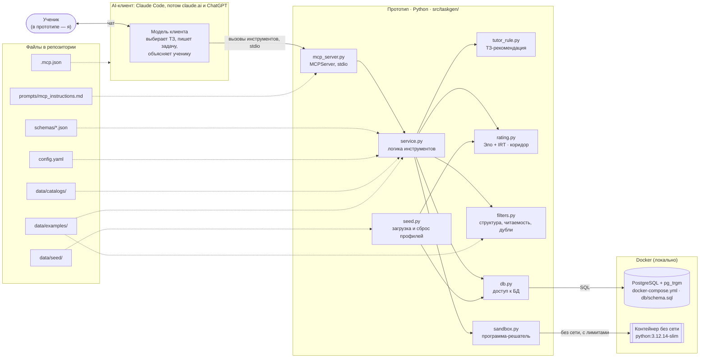

# 01. Контекстная схема

> Задача T01 из [RUN.md](../../RUN.md), перерисована в T19 после перехода на MCP (D42). Источник — [SPEC.md](../../SPEC.md), разделы 1, 2, 5, 7, 8, 10.

Из чего состоит прототип и с чем он общается. Ученик разговаривает со своим AI-клиентом, и текст задач и объяснений пишет модель клиента. Наш прототип — MCP-сервер на моей машине: клиент запускает его через stdio, сервер отдаёт данные и проверяет задачи, а рядом в Docker работают PostgreSQL и песочница. Своих вызовов LLM у прототипа нет.

## Схема

**Как читать:**
- Сплошная стрелка — вызов или запрос.
- Пунктирная стрелка — чтение файла или настройки.

## Инструменты MCP

| Инструмент | Для кого | Задача RUN |
|---|---|---|
| `get_student_profile` | для модели: выбрать следующую задачу | T19, готов |
| `get_progress` | для ученика: как у него дела | T19, готов |
| `get_next_task` | задача из банка или пакет, чтобы написать новую | T20, готов |
| `submit_task` | проверка и приём задачи, которую написала модель | T21, готов |
| `submit_answer` | ответ ученика, история и рейтинги | T22, готов |

## Компоненты

| Компонент | За что отвечает | SPEC |
|---|---|---|
| AI-клиент и его модель | Разговор с учеником; выбор ТЗ по рекомендации; текст задачи, программа-решатель, самопроверка; объяснения | 1, 3, 5, 8 |
| `mcp_server.py` | Тонкий адаптер `MCPServer`: инструменты, инструкции сервера, запуск через stdio | 5.8, 10 |
| `service.py` | Логика инструментов: обычные функции над БД, тестируются без MCP; `prompt_version` | 5.8 |
| `tutor_rule.py` | ТЗ по правилу — рекомендация для модели и базовая линия | 5.7 |
| `rating.py` | Вероятность P, обновление θ, δ, β, коридор сложности | 5.6 |
| `filters.py` | Структура задачи, читаемость условия, близкие дубли в банке и среди эталонов | 6 |
| `sandbox.py` | Выполнение программы-решателя в контейнере без сети, с лимитами времени, памяти и CPU | 5.3, 6 |
| `db.py` | Всё чтение и запись PostgreSQL, поиск в банке, похожесть через `pg_trgm` | 5.5, 7 |
| `seed.py` | Загрузка и сброс стартовых профилей, пересчёт рейтингов по стартовой истории | 3, 4.1 |
| `.mcp.json` | Подключение сервера к Claude Code: `uv run python -m taskgen.mcp_server` | 8, 10 |
| `prompts/mcp_instructions.md` | Порядок работы для модели клиента; уходит в `instructions` сервера | 5.8 |
| `schemas/` | JSON-схемы ТЗ, задачи и самопроверки, которые сдаёт модель | 5.1, 5.2, 5.4 |
| `config.yaml` | Лимит попыток, пороги `pace`, рейтинги, песочница, фильтры | 8 |
| `data/catalogs/` — `topics.json`, `skills.json`, `traps.json` | Закрытые каталоги тем, навыков и ловушек | 4.2, 4.4, 4.5 |
| `data/examples/<тема>.json` | 450 эталонных задач (T11) | 4.3 |
| `data/seed/*.json` | 5 стартовых профилей | 4.1 |
| PostgreSQL (`docker-compose.yml`, `db/schema.sql`) | Все данные: профили, история, рейтинги, банк задач, журналы, view датасетов | 7 |
| Контейнер без сети | Изоляция недоверенного кода, который пишет модель | 5.3 |

## Что пересекает границу прототипа

- **Наружу уходят только ответы инструментов** — в модель клиента, которая работает у своего провайдера по условиям подписки пользователя. В них профиль ученика (только псевдоним, но с `cognitive_profile`), ТЗ, эталоны и задачи. Поэтому никаких реальных данных ребёнка (SPEC 4.1).
- **Сами мы никуда не ходим:** ни в LLM API, ни в другие сервисы.
- **Песочница не имеет сети:** код от модели не может ничего отправить наружу.
- **Всё остальное локально:** PostgreSQL в Docker, файлы в репозитории.

## Замечания к SPEC

Найдены при построении первой версии схемы. Статусы обновлены.

1. **Модуль для проверок не назван.** Структурная проверка, фильтр читаемости и поиск близких дублей (SPEC 6) есть в логике, но не в SPEC 10. Предложение: `checks.py`. **Решено в T15:** модуль назван `filters.py`, как задача и тест в RUN; добавлен в SPEC 10 — см. D38 в [decisions.md](../decisions.md).
2. **Не указано, где лежат списки для «зерна» Генератора** (SPEC 5.2: типы сюжета, структуры условия, персонажи). Предложение: `story_seeds.json` рядом с каталогами. После перехода на MCP (D42) «зерна» в SPEC нет: разнообразие дают эталоны и последние задачи ученика. Оставляю открытым до живого прогона (T23): если задачи окажутся однообразными, вернёмся к спискам.
3. **Нет цен моделей для учёта стоимости.** `llm.py` считает стоимость (SPEC 8), но цен в `config.yaml` из SPEC 8 нет. Предложение: секция `prices` в `config.yaml`. **Снято в T18 (D42):** своих вызовов LLM нет, цены не нужны; секция `prices` удалена.
