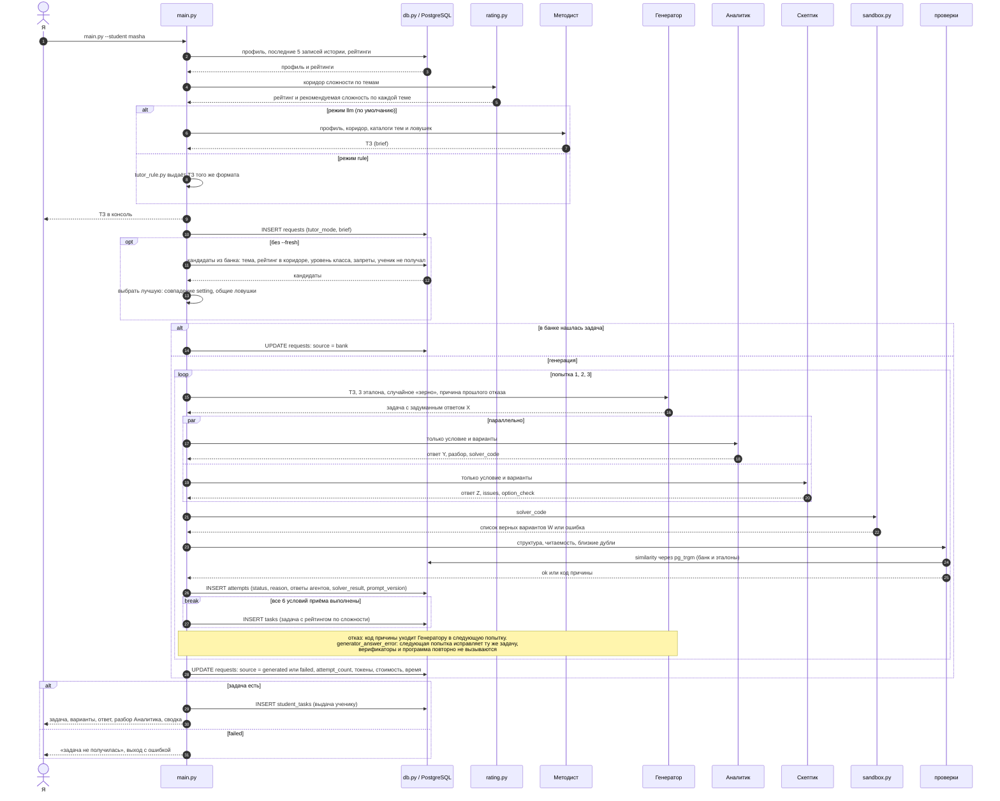
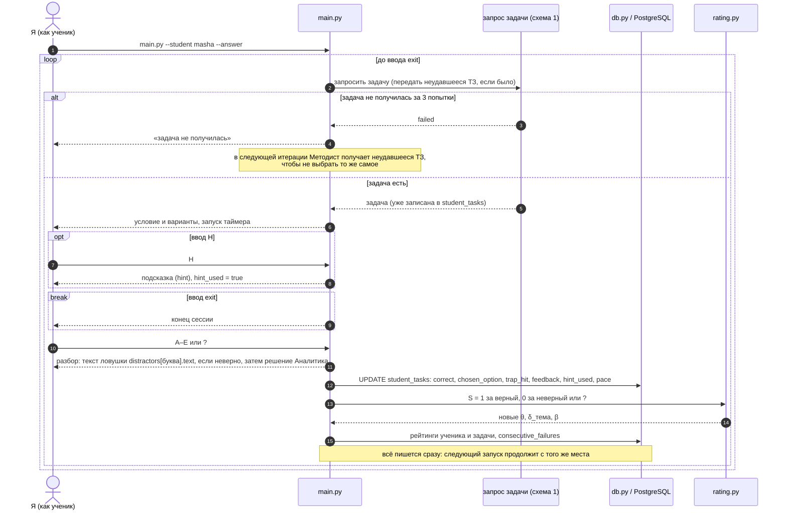

# 02. Поток одного запроса и цикл `--answer`

> Задача T02 из [RUN.md](../../RUN.md). Источник — [SPEC.md](../../SPEC.md), разделы 3, 5, 6. Компоненты — из [01-context.md](01-context.md).
>
> **Устарело после перехода на MCP (D42).** Диаграммы ниже описывают консольный запуск и цикл `--answer` с агентами на Claude API. Теперь запрос идёт из чата AI-клиента через инструменты MCP — порядок шагов в SPEC 3 и 5.8. Замечания этого файла закрыты решением D42: ТЗ в консоли больше не печатается (02-1), `pace` считает сервер по полному времени от выдачи до ответа, с подсказкой (02-2).

Здесь показано, в каком порядке вызываются компоненты и в какой момент что пишется в БД. Агенты ходят в Claude через `llm.py` — на схемах это не показано, чтобы не загромождать.

## 1. Одиночный запуск

`python -m taskgen.main --student masha [--fresh] [--tutor rule]`

## 2. Цикл `--answer`

`python -m taskgen.main --student masha --answer`

Шаг «запрос задачи» — это весь поток из схемы 1, от чтения профиля до записи в `student_tasks`.

## Сверка со SPEC

**SPEC 3 — одиночный запуск:**

| Шаг SPEC | Где на схеме 1 |
|---|---|
| 1. Профиль и рейтинги из БД, коридор | запросы к `db.py` и `rating.py` в начале |
| 2. Методист выдаёт ТЗ, печать в консоль | блок `alt` llm / rule, «ТЗ в консоль» |
| 3. Поиск в банке | блок `opt без --fresh` и ветка «в банке нашлась задача» |
| 4. Генератор → Аналитик + Скептик → программа, до 3 попыток | `loop` с блоком `par` и вызовом `sandbox.py` |
| 5. Выдача в `student_tasks` | INSERT `student_tasks` в конце |
| 6. Вывод в консоль со сводкой | последнее сообщение Я |
| 7. Запрос и попытки в БД | INSERT/UPDATE `requests`, INSERT `attempts` |
| Флаг `--fresh` | блок `opt без --fresh` пропускается |

**SPEC 3 — цикл `--answer`:**

| Шаг SPEC | Где на схеме 2 |
|---|---|
| 1. Профиль и 5 записей истории | внутри «запрос задачи» (схема 1) |
| 2. Задача, запись в `student_tasks` | ответ «задача есть» |
| 3. Ввод `A`–`E`, `?`, `H`, `exit` | блоки `opt ввод H`, `break ввод exit`, сообщение «A–E или ?» |
| 4. Разбор | сообщение «разбор» |
| 5. Ответ в `student_tasks` | UPDATE `student_tasks` |
| 6. `consecutive_failures` и рейтинги | вызов `rating.py` и запись рейтингов |
| 7. Методисту последние 5 записей | внутри «запрос задачи» |
| 8. Следующая итерация | внешний `loop` |
| Неудача за 3 попытки | ветка «задача не получилась» |

**SPEC 6 — условия приёма:**

| Условие | Где на схеме 1 |
|---|---|
| 1. JSON по схеме, 5 вариантов, 4 дистрактора, `hint` | вызов «проверки» (структура) |
| 2. X == Y == Z | ответы Генератора, Аналитика и Скептика |
| 3. Программа вернула ровно `[X]` | вызов `sandbox.py` |
| 4. Нет блокирующих issues | ответ Скептика |
| 5. Читаемость | вызов «проверки» |
| 6. Нет близкого дубля | «проверки» → `pg_trgm` |
| Аналитик и Скептик параллельно | блок `par` |
| Ретрай с причиной, `generator_answer_error` | заметка внутри `loop` |

## Замечания к SPEC

Замечания из [01-context.md](01-context.md) остаются в силе. Новые:

1. **Когда показывать ТЗ в режиме `--answer`.** SPEC 3 требует печатать ТЗ Методиста в консоль, но в `--answer` я играю ученика, и ТЗ раскрывает тему и ловушки заранее. Предложение: в `--answer` ТЗ не показывать, а показывать по флагу `--show-brief`.
2. **`pace` при подсказке.** Таймер идёт от показа задачи до ответа, то есть с подсказкой время больше. В SPEC не сказано, считать ли время подсказки. Предложение: считать полное время. Подсказка и так видна в `hint_used`.
