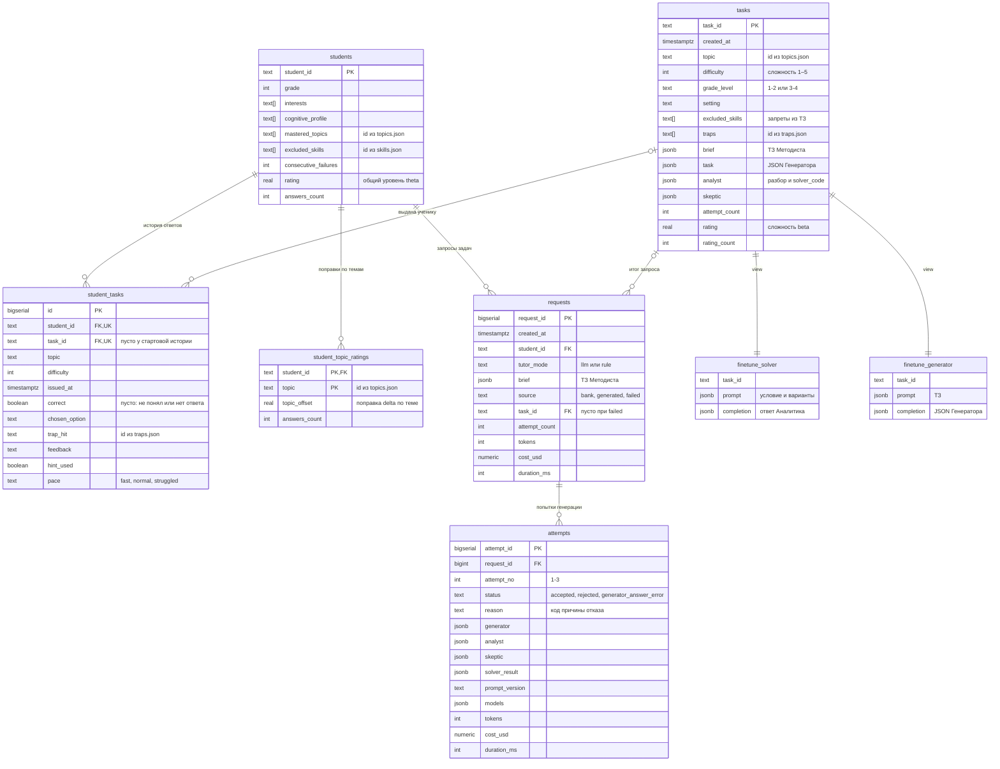

# 03. Схема данных

> Задача T03 из [RUN.md](../../RUN.md). Источник — [SPEC.md](../../SPEC.md), разделы 5.5, 5.6, 7. Шаги потока — из [02-request-flow.md](02-request-flow.md).

В БД 6 таблиц и 2 view. Каталоги тем, навыков и ловушек — это файлы, а не таблицы. Таблицы ссылаются на них по id, но без внешних ключей: проверка идёт в коде.

## ER-диаграмма

**Как читать связи:**
- `||--o{` — один ко многим, ссылка обязательна.
- `|o--o{` — ссылка может быть пустой (NULL): у стартовой истории нет задачи из банка, у неудачного запроса нет итоговой задачи.
- `||--||` — view: одна строка на каждую задачу банка.
- `UK` у `student_tasks` — составной `UNIQUE (student_id, task_id)`: ученик не получает одну задачу дважды. Пустые `task_id` стартовой истории под это ограничение не попадают — в PostgreSQL NULL не равен NULL.

## Кто пишет и кто читает

| Таблица | Кто пишет (модуль · шаг) | Кто читает (модуль · шаг) |
|---|---|---|
| `students` | `seed.py` — загрузка и сброс, θ после пересчёта стартовой истории. `main.py` через `db.py` в `--answer` после ответа — `consecutive_failures`, `rating`, `answers_count` | `main.py` в начале запроса — профиль для Методиста или правила. `rating.py` — θ для коридора. `db.py` — `excluded_skills` для поиска в банке |
| `student_topic_ratings` | `seed.py` — пересчёт стартовой истории. `main.py` в `--answer` после ответа — δ темы этой задачи | `rating.py` — коридор по темам. `tutor_rule.py` — через коридор |
| `student_tasks` | `seed.py` — стартовая история (`task_id` пустой). `main.py` — INSERT при выдаче задачи из банка или после генерации. `main.py` в `--answer` — UPDATE ответом | `main.py` — последние 5 записей для Методиста. `db.py` — поиск в банке: не выдавалась ли задача. `tutor_rule.py` — давно не решавшиеся темы, частые `trap_hit`. Отчёт (T29) |
| `tasks` | `main.py` — INSERT после принятой попытки, β по сложности. `main.py` в `--answer` — UPDATE `rating`, `rating_count` после ответа | `db.py` — поиск в банке. Проверки — близкие дубли по условию через `pg_trgm`. View датасетов. Ручная проверка (T30) |
| `requests` | `main.py` — INSERT после ТЗ; UPDATE в конце запроса: `source`, `task_id`, попытки, токены, стоимость, время | Отчёт (T29), прогонщик (T28). Неудавшееся ТЗ для следующей итерации `--answer` передаётся в памяти, в БД оно остаётся для истории |
| `attempts` | `main.py` — INSERT после каждой попытки | Отчёт (T29): доли статусов и причин, `solver_disagrees`, стоимость по `prompt_version`. Мой ручной разбор отказов |
| `finetune_solver`, `finetune_generator` | никто: view вычисляются из `tasks` | Выгрузка для оценки локальных моделей во второй фазе |

## Ссылки на каталоги (без внешних ключей)

| Каталог | Кто ссылается | Где проверяется |
|---|---|---|
| `topics.json` | `students.mastered_topics`, `student_topic_ratings.topic`, `tasks.topic`, `student_tasks.topic`, `brief.target_concept` | валидатор каталогов и seed (T08, T09), JSON-схема ТЗ (T16) |
| `skills.json` | `students.excluded_skills`, `tasks.excluded_skills`, `brief.excluded_skills` | T08, T09, T16 |
| `traps.json` | `tasks.traps`, `student_tasks.trap_hit`, `brief.traps_to_use`, `task.distractors.*.trap` | T08, структурная проверка (T15) |

## Индексы для T07

В SPEC их нет; это заметка к реализации:

- триграммный GIN-индекс по `(task ->> 'question')` — поиск близких дублей;
- `tasks (topic, grade_level, rating)` — поиск в банке;
- `student_tasks (student_id, issued_at)` — последние 5 записей истории;
- `attempts (request_id)` — попытки запроса.

## Замечания к SPEC

Замечания из [01-context.md](01-context.md) и [02-request-flow.md](02-request-flow.md) остаются в силе. Новые:

1. **`task_id` в стартовой истории.** В примере профиля (SPEC 4.1) у записей истории есть `"task_id": "t-0012"`, а в SPEC 7 у стартовой истории `task_id` пустой. Если записать `t-0012`, сработает внешний ключ: такой задачи в `tasks` нет. Предложение: `seed.py` отбрасывает `task_id` стартовой истории, а из примера в SPEC 4.1 поле убрать. **Решено в T09:** `task_id` убран из формата профиля (`schemas/profile.json` его не пропускает) и из примера в SPEC 4.1 — см. D34 в [decisions.md](../decisions.md).
2. **У `attempts` нет времени создания.** Порядок попыток внутри запроса даёт `attempt_no`, а время есть у `requests.created_at`, так что для метрик этого хватает. Если понадобится смотреть длительность каждой попытки отдельно, она уже есть в `duration_ms`. Менять SPEC не обязательно — отмечаю, чтобы это было решение, а не забытое место.
3. **`requests.source` при создании запроса.** Запрос создаётся сразу после ТЗ, чтобы к нему привязывались попытки. Но итог (`bank`, `generated`, `failed`) в этот момент ещё неизвестен, а `source` — `NOT NULL`. **Сделано в T12:** `db.create_request` пишет `failed`, `db.close_request` ставит настоящий источник. Если `main.py` закоммитит запрос до генерации, запуск, упавший на полпути, останется в журнале как `failed`. Альтернатива — разрешить NULL в `source` («запрос не закрыт»); тогда отчёт (T29) должен считать незакрытые запросы отдельно. Решение за мной.
4. **Выбор из банка при равенстве.** SPEC 5.5 задаёт порядок: сначала совпадение `setting`, потом больше общих ловушек с `traps_to_use`. Что делать при равенстве, не сказано. **Сделано в T12:** берётся более старая задача (`created_at`), затем меньший `task_id`, так что выбор повторяемый. Альтернатива — случайный выбор среди равных, чтобы ученики с одинаковым ТЗ получали разные задачи.
