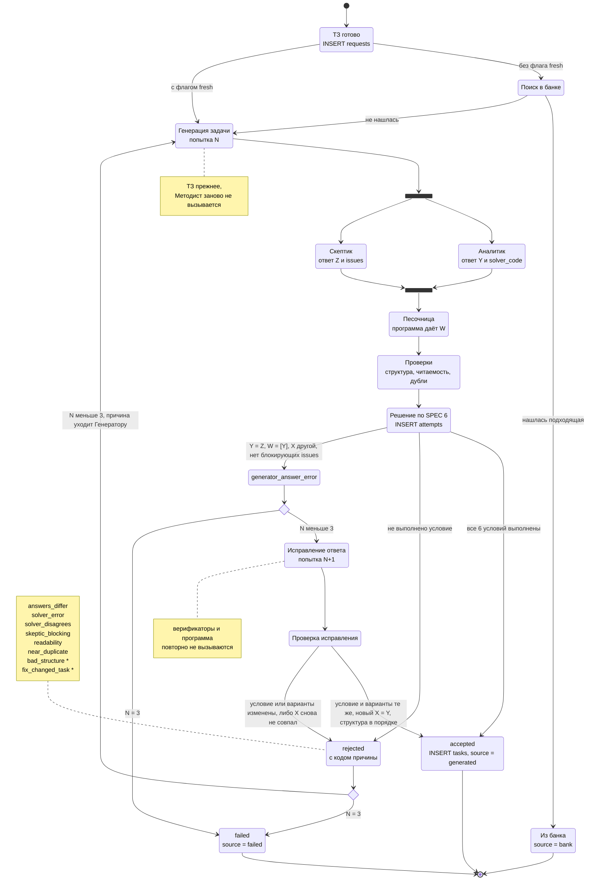

# 04. Автомат состояний попытки

> Задача T04 из [RUN.md](../../RUN.md). Источник — [SPEC.md](../../SPEC.md), разделы 6 и 7. Поток вызовов — в [02-request-flow.md](02-request-flow.md).
>
> **Устарело после перехода на MCP (D42).** Автомат ниже описывает попытку в прежнем конвейере с Генератором, Аналитиком и Скептиком на Claude API. Теперь попытка — один вызов `submit_task` от модели клиента, проверки и коды причин — в SPEC 6. Замечания этого файла закрыты решением D42: код `bad_structure` и порядок проверок вошли в SPEC 6 (04-1, 04-3); `generator_answer_error` и его исправление больше не нужны (04-2, 04-6); дешёвые проверки и повтор Аналитика потеряли смысл без платных вызовов (04-4, 04-5); неверный формат вывода программы — это `solver_error` (04-7).

Все исходы одного запроса задачи: откуда берётся задача, чем кончается каждая попытка и что происходит дальше. Обозначения: X — ответ Генератора, Y — Аналитика, Z — Скептика, W — список верных вариантов по программе Аналитика. N — номер попытки.

## Схема

`*` — кода нет в SPEC 6, это предложение (см. «Замечания к SPEC»).

## Как определяется исход попытки

В SPEC 6 перечислены условия, но не сказано, в каком порядке их проверять, а в `attempts.reason` пишется одна причина. Предлагаемый порядок — первая невыполненная проверка даёт код:

| Шаг | Проверка | Если не выполнена |
|---|---|---|
| 1 | Структура ответа Генератора (условие 1): 5 разных вариантов, 4 дистрактора, `hint`, id ловушек | `bad_structure` * |
| 2 | Программа Аналитика отработала без ошибки и уложилась в лимит | `solver_error` |
| 3 | У Скептика нет блокирующих issues (условие 4) | `skeptic_blocking` |
| 4 | Читаемость (условие 5) | `readability` |
| 5 | Нет близкого дубля (условие 6) | `near_duplicate` |
| 6 | Y = Z: Аналитик и Скептик согласны (часть условия 2) | `answers_differ` |
| 7 | W = [Y]: программа нашла ровно один верный вариант, тот же, что у верификаторов (условие 3) | `solver_disagrees` |
| 8 | X = Y: Генератор согласен с верификаторами (часть условия 2) | статус `generator_answer_error`, путь исправления |
| — | всё выполнено | `accepted` |

Почему такой порядок:
- **Структура первой:** без неё остальные проверки бессмысленны.
- **Ошибка программы до сравнения ответов:** без W сравнивать нечего.
- **Блокирующий дефект условия объясняет расхождения ответов**, поэтому он важнее самого расхождения.
- **Читаемость и дубли — до `generator_answer_error`:** исправление не меняет условие. Если условие слишком сложное для чтения или повторяет готовую задачу, исправлять ответ бесполезно.
- **`generator_answer_error` последним:** это единственный исход, где задачу чинят, а не выбрасывают. Он допустим, только когда всё остальное в порядке.

## Что уходит Генератору в следующую попытку

| Исход прошлой попытки | Что получает Генератор |
|---|---|
| `bad_structure` * | Какие правила структуры нарушены |
| `solver_error` | «Ответ не удалось проверить перебором» и текст ошибки. Но это, скорее всего, ошибка кода Аналитика, а не задачи (замечание 5) |
| `skeptic_blocking` | Блокирующие issues Скептика с комментариями |
| `readability` | Измеренный уровень текста, целевой класс, самые длинные предложения |
| `near_duplicate` | Текст похожей задачи и требование другой идеи и сюжета |
| `answers_differ` | Ответы X, Y, Z и все замечания Скептика, включая `minor`: условие, вероятно, допускает разные прочтения |
| `solver_disagrees` | W против общего ответа агентов: возможно, верны несколько вариантов или общий ответ неверен |
| `generator_answer_error` | Режим исправления: ответ верификаторов и прежние `question` и `options`. Требование исправить `correct_answer`, `solution`, `distractors`, при необходимости `hint` |
| `fix_changed_task` * | Исправление не удалось — следующая попытка делает новую задачу |

## Примеры цепочек попыток

| Цепочка | Итог | Попыток |
|---|---|---|
| accepted | `generated` | 1 |
| rejected → accepted | `generated` | 2 |
| generator_answer_error → исправление принято | `generated` | 2 |
| rejected → generator_answer_error → исправление принято | `generated` | 3 |
| rejected → rejected → rejected | `failed` | 3 |
| rejected → rejected → generator_answer_error | `failed`: на исправление попыток не осталось | 3 |

## Сверка со SPEC

| Требование SPEC 6 | Где на схеме |
|---|---|
| Аналитик и Скептик параллельно | развилка `fork_v` / `join_v` |
| 6 кодов причин отказа | заметка у состояния `rejected` |
| Лимит 3 попытки | выборы `after_rejected` и `after_gae`, переход в `failed` при N = 3 |
| Причина уходит Генератору, ТЗ прежнее | переход `after_rejected → Generate`, заметка у `Generate` |
| `generator_answer_error`: исправление, условие и варианты не меняются, верификаторы не вызываются | `GAE → Fix → FixCheck`, заметка у `Fix` |
| Исправление считается попыткой | `Fix` помечен как попытка N+1 |
| Задача из банка не создаёт попыток | `Bank → FromBank → конец` |

## Замечания к SPEC

Замечания из [01](01-context.md), [02](02-request-flow.md) и [03](03-data-model.md) остаются в силе. Новые:

1. **Нет кода причины для условия 1.** Structured outputs гарантируют форму JSON, но не смысл: одинаковые варианты, лишний ключ в `distractors`, неизвестный id ловушки. Предложение: код `bad_structure`.
2. **Нет кода причины для неудачного исправления.** SPEC говорит, что скрипт проверяет, не изменились ли условие и варианты, но не говорит, что делать, если изменились. Предложение: код `fix_changed_task`, следующая попытка делает новую задачу.
3. **Нет порядка проверок при нескольких отказах сразу.** Предложение — таблица «Как определяется исход попытки» выше. Дополнительно можно хранить все невыполненные проверки, не только первую, — колонка `attempts.failed_checks text[]`.
4. **Дешёвые проверки стоит делать до верификаторов.** Структура, читаемость и дубли зависят только от ответа Генератора. Если проверять их сразу после Генератора, плохая попытка не тратит 2 вызова Sonnet 5. Это меняет порядок в SPEC 5 и в схеме [02](02-request-flow.md).
5. **`solver_error` — скорее ошибка кода Аналитика, чем задачи.** Сейчас из-за бага в программе выбрасывается, возможно, хорошая задача. Предложение: при `solver_error` один раз повторить Аналитика в той же попытке (плюс один вызов Sonnet 5) и только потом отклонять.
6. **`generator_answer_error` на 3-й попытке теряет почти готовую задачу.** Исправление стоит один вызов Генератора и не вызывает верификаторов. Можно разрешить его сверх лимита — решение за мной.
7. **Вывод программы не в том формате.** `sandbox.run` (T14) различает четыре исхода: `ok`, `error` (код упал, в том числе по лимиту памяти), `timeout` и `bad_output` (последняя строка вывода — не JSON-список разных букв A–E, или вывод больше 64 КБ). SPEC 6 определяет `solver_error` как «код упал или не уложился в лимит», а неверный формат вывода не упоминает. Предложение: `bad_output` тоже считать `solver_error`, а что именно не так, передавать в `message` результата. Нужно до T23.
