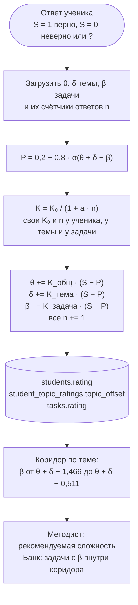

# 05. Рейтинги на числовом примере

> Задача T05 из [RUN.md](../../RUN.md). Источник — [SPEC.md](../../SPEC.md), раздел 5.6 и секция `rating` в `config.yaml` (раздел 8). Числа посчитаны скриптом на Python, а не вручную.
>
> Шкала сложности 1–5 введена решением D36 вместо прежних 3/4/5 баллов. Прежние 3, 4 и 5 баллов — это сложности 2, 3 и 4 с теми же β, поэтому все числа примера остались прежними.

Проверяем математику «Эло + IRT» на бумаге до кода. Числа отсюда станут тестовыми данными для T13.

## Поток обновления

P считается один раз по старым значениям, и все три параметра обновляются одной и той же ошибкой (S − P).

## Откуда границы коридора

Коридор — P ∈ [0,70; 0,85]. Разворачиваем формулу:

- P = 0,2 + 0,8 · σ(x), где x = θ + δ − β;
- P ∈ [0,70; 0,85] ⇔ σ(x) ∈ [0,625; 0,8125] ⇔ x ∈ [0,5108; 1,4663];
- значит, β ∈ [θ + δ − 1,4663; θ + δ − 0,5108].

Ширина коридора — 0,96 по шкале β, а соседние уровни сложности отстоят друг от друга на 1. Поэтому в коридор попадает **не больше одного** уровня, а иногда ни одного (замечание 1).

## Сложность → β → P

δ = 0, β = сложность − 3. Жирным — попадает в коридор [0,70; 0,85]. В скобках — рейтинг ученика в шахматной шкале R = 1500 + 173,7 · θ.

| Сложность | β | θ = −1 (R 1326) | θ = 0 (R 1500) | θ = +1 (R 1674) |
|---|---|---|---|---|
| 1 | −2 | **0,785** | 0,905 | 0,962 |
| 2 | −1 | 0,600 | **0,785** | 0,905 |
| 3 | 0 | 0,415 | 0,600 | **0,785** |
| 4 | +1 | 0,295 | 0,415 | 0,600 |
| 5 | +2 | 0,238 | 0,295 | 0,415 |

Как читать: новому ученику (θ = 0) подходит сложность 2. Сложность 3 он решает с вероятностью 60% — это ниже коридора. Слабому ученику (θ = −1) подходит сложность 1, сильному (θ = +1) — сложность 3. Сложности 4 и 5 рассчитаны на учеников с θ около +2 и +3.

## Числовой пример

**Параметры:** K₀ = 0,4, a = 0,05. Новый ученик: θ = 0, δ = 0 по теме `combinatorics.enumeration`. Три новые задачи этой темы подряд сложности 2, 3 и 3. Ответы: верно, неверно, «?».

### Шаг 1 вручную

- P = 0,2 + 0,8 · σ(0 + 0 − (−1)) = 0,2 + 0,8 · σ(1) = 0,2 + 0,8 · 0,7311 = **0,7848**
- S − P = 1 − 0,7848 = 0,2152
- K = 0,4 / (1 + 0,05 · 0) = 0,4 — у ученика, темы и задачи ещё ни одного ответа
- θ = 0 + 0,4 · 0,2152 = **0,0861**; δ = **0,0861**; β = −1 − 0,4 · 0,2152 = **−1,0861**

### Все шаги

| Шаг | Ответ | Сложность задачи, β до | P | S − P | K_общ = K_тема | K_задача | θ после | δ после | β задачи после |
|---|---|---|---|---|---|---|---|---|---|
| 1 | верно | 2, −1 | 0,7848 | +0,2152 | 0,4000 | 0,4000 | 0,0861 | 0,0861 | −1,0861 |
| 2 | неверно | 3, 0 | 0,6343 | −0,6343 | 0,3810 | 0,4000 | −0,1556 | −0,1556 | 0,2537 |
| 3 | «?» | 3, 0 | 0,5383 | −0,5383 | 0,3636 | 0,4000 | −0,3513 | −0,3513 | 0,2153 |

K_задача каждый раз 0,4: все три задачи новые, у каждой ещё не было ответов.

### Коридор после каждого шага

| Момент | θ + δ | R по θ | β коридора | P для сложности 1 / 2 / 3 / 4 / 5 | Сложность в коридоре |
|---|---|---|---|---|---|
| старт | 0 | 1500 | [−1,466; −0,511] | 0,905 / 0,785 / 0,600 / 0,415 / 0,295 | 2 |
| после шага 1 | 0,172 | 1515 | [−1,294; −0,339] | 0,918 / 0,811 / 0,634 / 0,443 / 0,311 | 2 |
| после шага 2 | −0,311 | 1473 | [−1,778; −0,822] | 0,875 / 0,733 / 0,538 / 0,370 / 0,272 | 2 |
| после шага 3 | −0,703 | 1439 | [−2,169; −1,213] | 0,828 / 0,659 / 0,465 / 0,323 / 0,250 | 1 |

### Что видно из примера

- **Верный ответ на лёгкую задачу почти ничего не меняет** (+0,086): модель и так ждала успеха с вероятностью 78%.
- **Ошибка на задаче посложнее сдвигает сильно** (−0,24 у θ и столько же у δ): в начале K большой.
- **После ошибки коридор сдвигается к более лёгким задачам:** граница β опустилась с [−1,29; −0,34] до [−1,78; −0,82]. Именно этого требует проверка T05.
- **После двух неудач подряд коридор перешёл на сложность 1:** задача сложности 2 даёт уже P = 0,66 < 0,70, а сложности 1 — 0,83. По прежней шкале 3/4/5 баллов здесь не подходил ни один уровень; пять уровней закрывают и более слабых учеников.
- **Задача сложности 3, которую ученик не решил, «потяжелела»** до β = 0,25 после одного ответа. Одиночный ответ — шумный сигнал, но K у задачи падает с каждым ответом.
- **θ и δ в примере двигаются одинаково:** оба стартуют с нуля и получают одинаковый K. Итоговый уровень θ + δ меняется на (K_общ + K_тема)·(S − P), то есть почти на 0,8 · (S − P) на первых ответах. Это быстро (замечание 2).

## Тестовые данные для T13

Таблица «Все шаги» и таблица коридора — эталон для `rating.py`. Допуск сравнения — 10⁻⁴, для чисел с тремя знаками — 5·10⁻⁴. Параметры: K₀ = 0,4, a = 0,05, угадывание 0,2, коридор [0,70; 0,85], β = сложность − 3 (1 → −2, 2 → −1, 3 → 0, 4 → +1, 5 → +2).

K₀ = 0,4 здесь общий для θ, δ и β. С T13 в `config.yaml` раздельные значения 0,2 / 0,4 / 0,4 (замечание 2, D37), поэтому `tests/test_rating.py` передаёт 0,4 для всех трёх явно.

## Замечания к SPEC

Замечания из [01](01-context.md)–[04](04-attempt-states.md) остаются в силе. Новые:

1. **Коридор может быть пустым.** Ширина коридора (0,96) меньше шага между уровнями сложности (1), поэтому в него попадает не больше одного уровня, а иногда ни одного. Например, при θ + δ = 0,5 коридор β = [−0,97; −0,01] не содержит ни −1, ни 0. Очень слабому ученику (θ + δ < −1,49) не подходит даже сложность 1, очень сильному (θ + δ > 3,47) — даже 5. В SPEC 5.6 не сказано, что тогда рекомендовать. Методист-правило (SPEC 5.7) берёт «середину коридора», которой при одном уровне или его отсутствии просто нет. Предложение:
   - рекомендовать уровень сложности, у которого P ближе всего к середине коридора (0,775), с пометкой «ниже коридора» или «выше коридора»;
   - банк искать по диапазону β как есть: он непрерывный, так что задачи с «уехавшим» β в нём найдутся.

   **Решено в T13:** так и сделано — `rating.corridor` возвращает рекомендуемую сложность и пометку `inside`, `too_hard` или `too_easy`; записано в SPEC 5.6 и 5.7, см. D37 в [decisions.md](../decisions.md).
2. **Один K для θ и δ удваивает шаг.** На первых ответах уровень ученика по теме меняется почти на 0,8 · (S − P). Две ошибки подряд опустили его на 0,7 — почти целый уровень сложности. Предложение: разные K₀ в `config.yaml` — `k0_student`, `k0_topic`, `k0_task`. Например, общий уровень двигать медленнее (0,2), поправку по теме — быстрее (0,4). Окончательные значения — по данным прогонов. **Решено в T13:** в `config.yaml` `k0_student` = 0,2, `k0_topic` = 0,4, `k0_task` = 0,4 (D37).
3. **Чей счётчик n в K.** SPEC пишет «K уменьшается с числом ответов», но не уточняет, чьих. Я взял отдельные счётчики: у ученика (`students.answers_count`), у темы (`student_topic_ratings.answers_count`), у задачи (`tasks.rating_count`). Это совпадает с колонками SPEC 7. Стоит записать явно. **Решено в T13:** записано в SPEC 5.6 (D37).
4. **Стартовая история не двигает β задач.** У записей стартовой истории нет задачи в банке (`task_id` пустой, см. [03](03-data-model.md)). При пересчёте в `seed.py` β берётся по сложности и нигде не сохраняется — обновляются только θ и δ. Стоит записать явно. **Решено в T13:** записано в SPEC 5.6 (D37).
